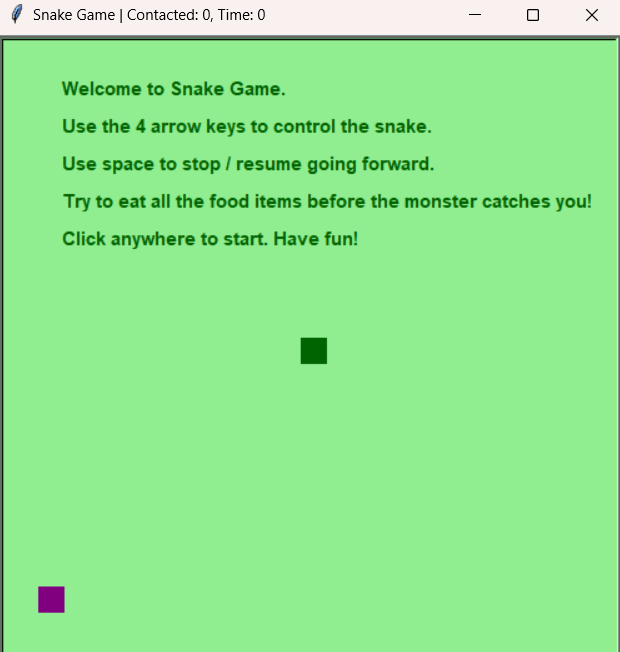
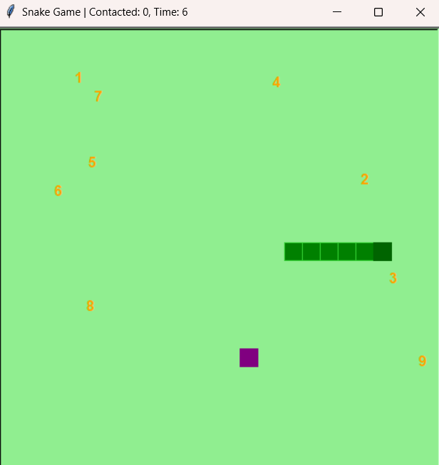
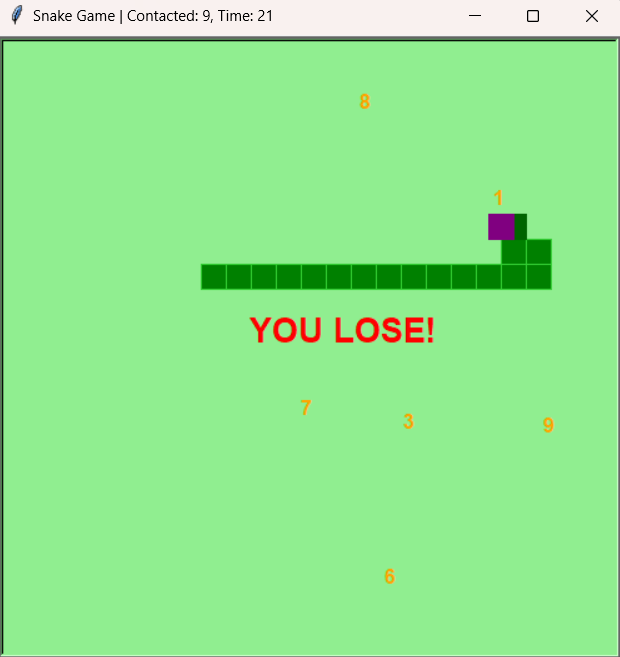
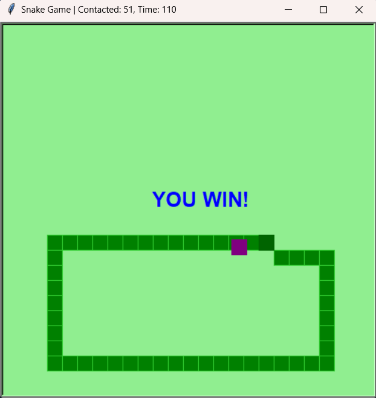

# snake-game

## Description

This is an exciting variation of the classic Snake game, implemented in Python using the Turtle graphics library. In this version, you control a snake that must eat numbered food items while avoiding a pursuing monster.

## Features

- **Unique Gameplay**: Eat numbered food items to grow longer, but beware of the monster chasing you!
- **Scoring System**: Each food item has a number (1-9) that determines how much your snake grows when eaten.
- **Dynamic Difficulty**: The snake moves slower when it's growing, adding a strategic element to the game.
- **Time Challenge**: A timer keeps track of how long you've been playing.
- **Contact Counter**: Tracks how many times the monster touches your snake's tail.

## Controls

- **Arrow Keys**: Control the snake's direction
- **Spacebar**: Pause/Resume the motion of your snake

## Objective

Eat all the food items before the monster catches you. You win if your snake reaches a length of 50!

## Game Elements

- **Snake**: Controlled by the player, grows longer as it eats.
- **Monster**: Pursues the snake, trying to catch it.
- **Food Items**: Numbered 1-9, scattered across the game area.

## Installation

1. Ensure you have Python installed on your system.
2. No additional libraries are required as the game uses the built-in `turtle` module.
3. Download the game script and run it using Python.

## How to Play

1. Run the script to start the game.
2. Click anywhere on the game window to begin.
3. Use the arrow keys to navigate the snake towards food items.
4. Avoid the purple monster that's chasing you.
5. Try to eat all the food and grow to length 50 to win!

## Game Over Conditions

- The monster catches your snake's head.
- Your snake grows to length 50 (You win!).

## Screenshots

 

 

## Contributing

   Contributions are welcome! Please feel free to submit a Pull Request.

## License

   This project is licensed under the MIT License - see the [LICENSE](LICENSE) file for details.